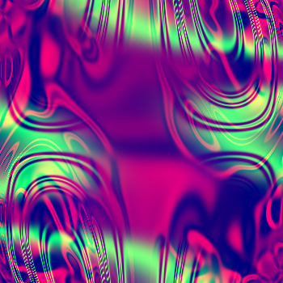
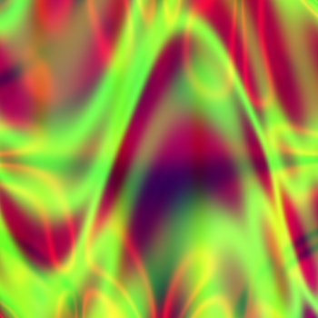
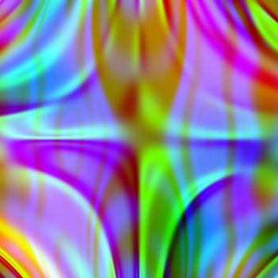
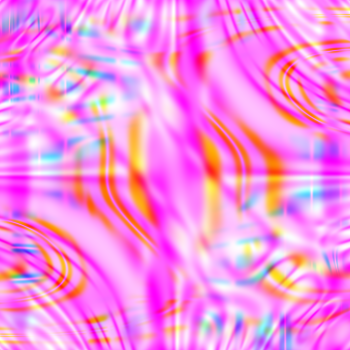
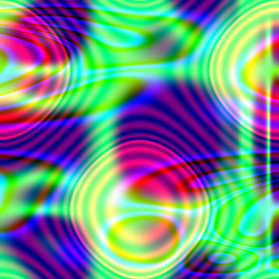

# Computational Art
 Repository for Mini Project 2: Computational Art

Run `recursive_art.py` to generate art.  
See **[reflection](reflection.md)** for more details.  

Examples:  
    
    
    

In the main function at the end of the file, the user can call these functions:

    generate_art: generate an image and corresponding function file based on the given parameters
    generate_multi_art: generate_art 'num_images' number of times, labeling the images sequentially
    regenerate_art: regenerate an image from a specified function file (slow)  

Currently, it creates three images and reproduces the middle one. Example run output included.  

User can override the default parameters or modify them at the top of the file. It may be useful to modify defaults and not specify overrides unless necessary when calling functions in main, making the program easier to use.  
